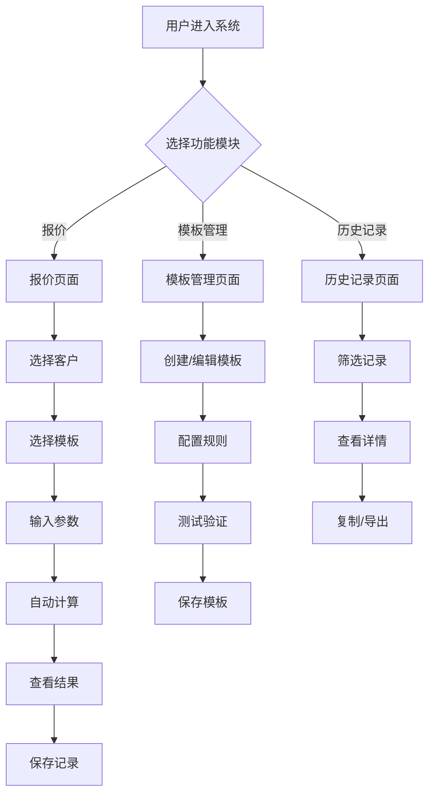

# 纸箱报价系统 - 产品需求文档

## 1. 产品概述

纸箱报价系统是一款面向纸箱制造企业和包装行业的移动端报价工具,旨在解决纸箱报价过程中参数复杂、计算繁琐、历史数据难以追溯等行业痛点。系统通过模板化的箱型管理、智能化的成本计算和完整的历史记录追溯,帮助销售人员快速生成精准报价,提升报价效率和准确性。

核心价值:
- 将报价时间从传统的30分钟缩短至30秒
- 支持标准箱型和非标定制箱型的统一管理
- 提供完整的成本拆解和历史比价功能
- 移动端优先设计,随时随地快速报价

## 2. 核心功能

### 2.1 用户角色

| 角色 | 权限说明 |
|------|---------|
| 销售人员 | 创建报价、查看模板、查看历史记录 |
| 管理员 | 管理模板、编辑参数配置、导出数据 |

### 2.2 功能模块

#### 模块一:报价计算模块
**核心功能:**
1. **参数输入区**
   - 客户信息:客户名称、客户等级(普通/长期/大客户)
   - 纸箱尺寸:长、宽、高(支持内径/外径切换)
   - 楞型选择:A楞、B楞、C楞、E楞、AB楞、BC楞等
   - 用纸配置:面纸克重、里纸克重、芯纸克重
   - 工艺要求:印刷色数、特殊工艺(烫金/覆膜等)
   - 订单数量

2. **模板选择**
   - 从模板库中选择预设箱型模板
   - 自动加载模板的计算规则和参数配置

3. **成本计算引擎**
   - 用料面积计算
   - 纸料成本核算
   - 损耗成本计算(默认5%)
   - 工艺附加费计算
   - 利润核算(按客户等级自动调整)
   - 税费计算(默认13%增值税)

4. **报价结果展示**
   - 单个纸箱报价
   - 订单总价
   - 成本拆解明细(纸料/损耗/工艺/利润/税费)
   - 近期同类订单比价提示

#### 模块二:箱子模板管理模块
**核心功能:**
1. **模板列表**
   - 显示所有模板(标准/半定制/全自定义)
   - 支持按箱型分类筛选
   - 模板搜索功能

2. **模板编辑器**
   - **标准箱型模板**:预置国标箱型公式(0201外箱、0301内盒等)
   - **半定制模板**:在标准模板基础上修改参数(接头余量、补偿值等)
   - **全自定义模板**:
     - 创建自定义参数(如翼长系数、展开系数)
     - 定义计算规则(纸长、纸宽的计算公式)
     - 参数验证规则设置(范围限制、必填校验)
     - 上传箱型结构示意图

3. **模板配置项**
   - 基础信息:模板名称、箱型分类、描述
   - 计算规则:面积公式、重量公式、成本公式
   - 参数定义:动态参数列表、默认值、验证规则
   - 商业规则:默认利润率、损耗率、税率
   - 版本管理:模板版本号、修改历史

4. **模板预览**
   - 输入测试参数验证计算逻辑
   - 查看公式计算过程

#### 模块三:历史报价记录模块
**核心功能:**
1. **记录列表**
   - 显示所有历史报价记录
   - 支持按客户、时间、箱型、金额筛选
   - 搜索功能(客户名称、订单号)

2. **记录详情**
   - 完整的报价参数快照
   - 使用的模板版本信息
   - 成本拆解明细
   - 当时的市场纸价
   - 客户等级和利润率

3. **数据统计**
   - 按时间段统计报价数量和金额
   - 按客户统计报价频次
   - 按箱型统计报价分布

4. **操作功能**
   - 复制历史报价创建新报价
   - 导出报价单(PDF/Excel)
   - 删除记录

### 2.3 页面详情

| 页面名称 | 模块名称 | 功能描述 |
|---------|---------|---------|
| 报价页面 | 参数输入区 | 输入客户信息、纸箱尺寸、楞型、工艺等参数 |
| 报价页面 | 模板选择区 | 选择预设箱型模板,自动加载计算规则 |
| 报价页面 | 计算结果区 | 显示报价金额、成本拆解、比价提示 |
| 模板管理页面 | 模板列表 | 展示所有模板,支持筛选和搜索 |
| 模板管理页面 | 模板编辑器 | 创建和编辑模板,配置计算规则和参数 |
| 模板管理页面 | 模板预览 | 测试模板计算逻辑 |
| 历史记录页面 | 记录列表 | 展示历史报价记录,支持筛选和搜索 |
| 历史记录页面 | 记录详情 | 查看完整的报价参数和成本明细 |
| 历史记录页面 | 数据统计 | 图表展示报价统计数据 |

## 3. 核心流程

### 3.1 报价流程
用户进入报价页面 → 选择或创建客户信息 → 选择箱型模板 → 输入纸箱参数(尺寸、楞型、工艺等) → 系统自动计算成本和报价 → 查看成本拆解和比价提示 → 确认并保存报价记录 → 导出报价单

### 3.2 模板创建流程
进入模板管理页面 → 点击创建模板 → 选择模板类型(标准/半定制/全自定义) → 配置基础信息 → 定义计算规则和参数 → 设置验证规则 → 上传结构示意图(可选) → 测试验证 → 保存模板

### 3.3 历史查询流程
进入历史记录页面 → 设置筛选条件(客户/时间/箱型) → 查看记录列表 → 点击查看详情 → 查看完整参数和成本拆解 → 可选:复制为新报价或导出



## 4. 用户界面设计

### 4.1 设计风格
- **主色调**:工业蓝(#1E40AF) + 橙色强调(#F97316),体现专业性和活力
- **辅助色**:浅灰背景(#F8FAFC)、深灰文字(#1E293B)
- **按钮风格**:圆角矩形(12px),主按钮填充色,次按钮描边,触摸友好尺寸(最小44px高度)
- **字体**:
  - 标题:思源黑体 Bold / Noto Sans SC Bold (18-24px)
  - 正文:思源黑体 Regular / Noto Sans SC Regular (14-16px)
  - 数字:Roboto Mono(用于价格和计算数据)
- **布局风格**:底部标签导航 + 顶部标题栏,单列卡片式布局
- **图标**:线性图标风格,统一2px线宽,24px尺寸

### 4.2 移动端页面设计概览

| 页面名称 | 模块名称 | UI元素 |
|---------|---------|--------|
| 报价页面 | 参数输入区 | 垂直表单布局,分组卡片,输入框带单位提示,底部弹出选择器 |
| 报价页面 | 模板选择区 | 横向滑动卡片,模板预览图,选中高亮边框 |
| 报价页面 | 计算结果区 | 大号数字显示金额,可折叠成本拆解卡片,对比提示卡片 |
| 模板管理页面 | 模板列表 | 垂直卡片列表,状态标签,右侧操作按钮 |
| 模板管理页面 | 模板编辑器 | 分步表单,底部固定操作栏,滑动切换配置项 |
| 模板管理页面 | 模板预览 | 全屏模态框,参数输入,实时计算结果 |
| 历史记录页面 | 记录列表 | 垂直卡片列表,顶部筛选栏,下拉刷新 |
| 历史记录页面 | 记录详情 | 底部抽屉,分组信息展示,成本拆解图表 |
| 历史记录页面 | 数据统计 | 可滑动图表区(柱状图/饼图),数据卡片 |

### 4.3 移动端交互设计

#### 4.3.1 导航结构
- **底部标签栏**:报价、模板、历史、我的(4个主入口)
- **顶部标题栏**:页面标题 + 返回按钮 + 操作按钮
- **手势操作**:
  - 下拉刷新列表
  - 上滑加载更多
  - 左滑删除记录
  - 长按复制/编辑

#### 4.3.2 输入优化
- **数字键盘**:尺寸、数量等数字输入自动弹出数字键盘
- **选择器**:楞型、客户等级等使用底部滚动选择器
- **智能提示**:输入客户名称时自动提示历史客户
- **快速填充**:常用参数组合一键填充

#### 4.3.3 结果展示
- **折叠面板**:成本拆解默认折叠,点击展开查看详情
- **图表交互**:触摸图表显示具体数值
- **分享功能**:一键分享报价单到微信/短信

### 4.4 响应式设计
- **移动优先**:主要针对移动端设计,适配320px-428px宽度
- **平板适配**:大屏设备自动调整卡片布局为双列
- **横屏支持**:计算结果页支持横屏查看详细图表

### 4.5 交互细节
- **动画效果**:
  - 页面切换:滑动过渡(300ms)
  - 卡片点击:轻微缩放反馈
  - 数字变化:数字滚动动画
  - 计算过程:加载动画(纸箱图标旋转)
  - 底部弹窗:从底部滑入
- **反馈提示**:
  - 成功操作:绿色Toast提示,1.5秒自动消失
  - 错误提示:红色Toast提示,需手动关闭
  - 警告提示:橙色Toast提示,带操作按钮
- **数据加载**:
  - 骨架屏加载效果
  - 列表滚动加载更多
  - 下拉刷新动画

### 4.6 移动端特殊功能
- **离线使用**:支持离线查看历史记录和模板
- **数据同步**:联网时自动同步数据到云端
- **推送通知**:纸价变动提醒、报价审批通知
- **扫码输入**:扫描纸箱标签自动填充参数
- **语音输入**:支持语音输入客户名称和备注

## 5. 核心计算公式

### 5.1 外箱面积计算
```
面积(㎡) = (长 + 宽 + 接头余量) × (宽 + 2×高 + 修边余量) / 10000
```
- 接头余量:默认5cm,可配置
- 修边余量:默认3cm,可配置

### 5.2 成本计算链
```
纸料成本 = 面积 × 纸板单价
损耗成本 = 纸料成本 × 损耗率
工艺成本 = 印刷费 + 特殊工艺费
小计成本 = 纸料成本 + 损耗成本 + 工艺成本
利润 = 小计成本 × 利润率
税费 = (小计成本 + 利润) × 税率
最终报价 = 小计成本 + 利润 + 税费
```

### 5.3 客户等级利润率
- 普通客户:15%
- 长期客户:10%
- 大客户:8%

### 5.4 楞型伸长系数
- A楞:1.53
- B楞:1.36
- C楞:1.50
- E楞:1.27
- AB楞:1.53 × 1.36 = 2.08
- BC楞:1.50 × 1.36 = 2.04

## 6. 数据存储

### 6.1 本地存储策略
- 使用浏览器 localStorage 存储历史记录和自定义模板
- 数据结构采用 JSON 格式
- 支持数据导出和导入功能

### 6.2 数据备份
- 提供一键导出所有数据功能(JSON格式)
- 支持从备份文件恢复数据

## 7. 技术架构

### 7.1 前端技术栈
- **框架**:React 18 + Vite
- **UI库**:Tailwind CSS 3
- **状态管理**:React Context + useReducer
- **路由**:React Router v6
- **图表**:Recharts
- **动画**:Framer Motion

### 7.2 PWA特性
- Service Worker 离线缓存
- Add to Home Screen
- Push Notifications(可选)

### 7.3 性能优化
- 代码分割和懒加载
- 图片压缩和懒加载
- 虚拟列表(长列表优化)
- 防抖和节流

## 8. 未来扩展

### 8.1 第二期功能
- 用户登录和多租户支持
- 云端数据同步
- 客户管理模块
- 供应商纸价管理
- 报价审批流程

### 8.2 第三期功能
- 原生APP(iOS/Android)
- 微信小程序
- API接口开放
- 与ERP系统对接
