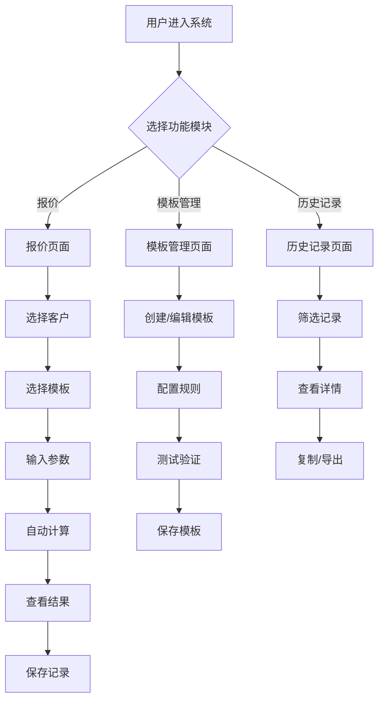

# 纸箱报价系统 - 产品需求文档

## 1. 产品概述

纸箱报价系统是一款面向纸箱制造企业和包装行业的专业报价工具，旨在解决纸箱报价过程中参数复杂、计算繁琐、历史数据难以追溯等行业痛点。系统通过模板化的箱型管理、智能化的成本计算和完整的历史记录追溯，帮助销售人员快速生成精准报价，提升报价效率和准确性。

核心价值：
- 将报价时间从传统的30分钟缩短至30秒
- 支持标准箱型和非标定制箱型的统一管理
- 提供完整的成本拆解和历史比价功能

## 2. 核心功能

### 2.1 用户角色

| 角色 | 权限说明 |
|------|---------|
| 销售人员 | 创建报价、查看模板、查看历史记录 |
| 管理员 | 管理模板、编辑参数配置、导出数据 |

### 2.2 功能模块

#### 模块一：报价计算模块
**核心功能：**
1. **参数输入区**
   - 客户信息：客户名称、客户等级（普通/长期/大客户）
   - 纸箱尺寸：长、宽、高（支持内径/外径切换）
   - 楞型选择：A楞、B楞、C楞、E楞、AB楞、BC楞等
   - 用纸配置：面纸克重、里纸克重、芯纸克重
   - 工艺要求：印刷色数、特殊工艺（烫金/覆膜等）
   - 订单数量

2. **模板选择**
   - 从模板库中选择预设箱型模板
   - 自动加载模板的计算规则和参数配置

3. **成本计算引擎**
   - 用料面积计算
   - 纸料成本核算
   - 损耗成本计算（默认5%）
   - 工艺附加费计算
   - 利润核算（按客户等级自动调整）
   - 税费计算（默认13%增值税）

4. **报价结果展示**
   - 单个纸箱报价
   - 订单总价
   - 成本拆解明细（纸料/损耗/工艺/利润/税费）
   - 近期同类订单比价提示

#### 模块二：箱子模板管理模块
**核心功能：**
1. **模板列表**
   - 显示所有模板（标准/半定制/全自定义）
   - 支持按箱型分类筛选
   - 模板搜索功能

2. **模板编辑器**
   - **标准箱型模板**：预置国标箱型公式（0201外箱、0301内盒等）
   - **半定制模板**：在标准模板基础上修改参数（接头余量、补偿值等）
   - **全自定义模板**：
     - 创建自定义参数（如翼长系数、展开系数）
     - 定义计算规则（纸长、纸宽的计算公式）
     - 参数验证规则设置（范围限制、必填校验）
     - 上传箱型结构示意图

3. **模板配置项**
   - 基础信息：模板名称、箱型分类、描述
   - 计算规则：面积公式、重量公式、成本公式
   - 参数定义：动态参数列表、默认值、验证规则
   - 商业规则：默认利润率、损耗率、税率
   - 版本管理：模板版本号、修改历史

4. **模板预览**
   - 输入测试参数验证计算逻辑
   - 查看公式计算过程

#### 模块三：历史报价记录模块
**核心功能：**
1. **记录列表**
   - 显示所有历史报价记录
   - 支持按客户、时间、箱型、金额筛选
   - 搜索功能（客户名称、订单号）

2. **记录详情**
   - 完整的报价参数快照
   - 使用的模板版本信息
   - 成本拆解明细
   - 当时的市场纸价
   - 客户等级和利润率

3. **数据统计**
   - 按时间段统计报价数量和金额
   - 按客户统计报价频次
   - 按箱型统计报价分布

4. **操作功能**
   - 复制历史报价创建新报价
   - 导出报价单（PDF/Excel）
   - 删除记录

### 2.3 页面详情

| 页面名称 | 模块名称 | 功能描述 |
|---------|---------|---------|
| 报价页面 | 参数输入区 | 输入客户信息、纸箱尺寸、楞型、工艺等参数 |
| 报价页面 | 模板选择区 | 选择预设箱型模板，自动加载计算规则 |
| 报价页面 | 计算结果区 | 显示报价金额、成本拆解、比价提示 |
| 模板管理页面 | 模板列表 | 展示所有模板，支持筛选和搜索 |
| 模板管理页面 | 模板编辑器 | 创建和编辑模板，配置计算规则和参数 |
| 模板管理页面 | 模板预览 | 测试模板计算逻辑 |
| 历史记录页面 | 记录列表 | 展示历史报价记录，支持筛选和搜索 |
| 历史记录页面 | 记录详情 | 查看完整的报价参数和成本明细 |
| 历史记录页面 | 数据统计 | 图表展示报价统计数据 |

## 3. 核心流程

### 3.1 报价流程
用户进入报价页面 → 选择或创建客户信息 → 选择箱型模板 → 输入纸箱参数（尺寸、楞型、工艺等） → 系统自动计算成本和报价 → 查看成本拆解和比价提示 → 确认并保存报价记录 → 导出报价单

### 3.2 模板创建流程
进入模板管理页面 → 点击创建模板 → 选择模板类型（标准/半定制/全自定义） → 配置基础信息 → 定义计算规则和参数 → 设置验证规则 → 上传结构示意图（可选） → 测试验证 → 保存模板

### 3.3 历史查询流程
进入历史记录页面 → 设置筛选条件（客户/时间/箱型） → 查看记录列表 → 点击查看详情 → 查看完整参数和成本拆解 → 可选：复制为新报价或导出



## 4. 用户界面设计

### 4.1 设计风格
- **主色调**：工业蓝（#1E40AF）+ 橙色强调（#F97316），体现专业性和活力
- **辅助色**：浅灰背景（#F8FAFC）、深灰文字（#1E293B）
- **按钮风格**：圆角矩形（8px），主按钮填充色，次按钮描边
- **字体**：
  - 标题：思源黑体 Bold / Noto Sans SC Bold
  - 正文：思源黑体 Regular / Noto Sans SC Regular
  - 数字：Roboto Mono（用于价格和计算数据）
- **布局风格**：左侧导航栏 + 右侧内容区，卡片式布局
- **图标**：线性图标风格，统一2px线宽

### 4.2 页面设计概览

| 页面名称 | 模块名称 | UI元素 |
|---------|---------|--------|
| 报价页面 | 参数输入区 | 表单布局，分组卡片，输入框带单位提示，下拉选择器 |
| 报价页面 | 模板选择区 | 卡片网格布局，模板预览图，选中高亮边框 |
| 报价页面 | 计算结果区 | 大号数字显示金额，饼图展示成本占比，对比卡片 |
| 模板管理页面 | 模板列表 | 表格布局，状态标签，操作按钮组 |
| 模板管理页面 | 模板编辑器 | 左右分栏，左侧参数列表，右侧公式编辑器 |
| 模板管理页面 | 模板预览 | 模态框，参数输入，实时计算结果 |
| 历史记录页面 | 记录列表 | 表格布局，时间筛选器，状态标签 |
| 历史记录页面 | 记录详情 | 侧边抽屉，分组信息展示，成本拆解图表 |
| 历史记录页面 | 数据统计 | 图表区（柱状图/饼图），数据卡片 |

### 4.3 响应式设计
- **桌面优先**：主要针对桌面端设计，最小宽度1200px
- **平板适配**：导航栏可折叠，卡片布局自适应
- **移动端**：暂不支持，后续版本考虑

### 4.4 交互细节
- **动画效果**：
  - 页面切换：淡入淡出（300ms）
  - 卡片悬停：轻微上浮 + 阴影加深
  - 数字变化：数字滚动动画
  - 计算过程：加载动画（纸箱图标旋转）
- **反馈提示**：
  - 成功操作：绿色Toast提示，自动消失
  - 错误提示：红色Toast提示，需手动关闭
  - 警告提示：橙色Toast提示，带操作按钮
- **数据加载**：
  - 骨架屏加载效果
  - 列表滚动加载更多

## 5. 核心计算公式

### 5.1 外箱面积计算
```
面积(㎡) = (长 + 宽 + 接头余量) × (宽 + 2×高 + 修边余量) / 10000
```
- 接头余量：默认5cm，可配置
- 修边余量：默认3cm，可配置

### 5.2 成本计算链
```
纸料成本 = 面积 × 纸板单价
损耗成本 = 纸料成本 × 损耗率
工艺成本 = 印刷费 + 特殊工艺费
小计成本 = 纸料成本 + 损耗成本 + 工艺成本
利润 = 小计成本 × 利润率
税费 = (小计成本 + 利润) × 税率
最终报价 = 小计成本 + 利润 + 税费
```

### 5.3 客户等级利润率
- 普通客户：15%
- 长期客户：10%
- 大客户：8%

### 5.4 楞型伸长系数
- A楞：1.53
- B楞：1.36
- C楞：1.50
- E楞：1.27
- AB楞：1.53 × 1.36 = 2.08
- BC楞：1.50 × 1.36 = 2.04

## 6. 数据存储

### 6.1 本地存储策略
- 使用浏览器 localStorage 存储历史记录和自定义模板
- 数据结构采用 JSON 格式
- 支持数据导出和导入功能

### 6.2 数据备份
- 提供一键导出所有数据功能（JSON格式）
- 支持从备份文件恢复数据

## 7. 未来扩展

### 7.1 第二期功能
- 用户登录和多租户支持
- 云端数据同步
- 客户管理模块
- 供应商纸价管理
- 报价审批流程

### 7.2 第三期功能
- 移动端APP
- 微信小程序
- API接口开放
- 与ERP系统对接
