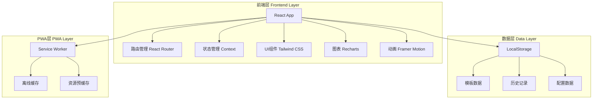
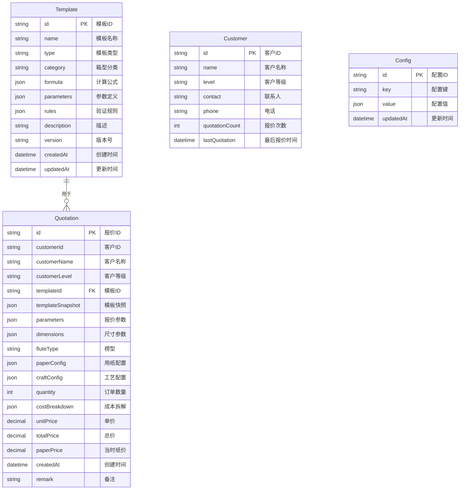

# 纸箱报价系统 - 技术架构文档

## 1. 架构设计



## 2. 技术描述

### 2.1 前端技术栈
- **框架**: React 18.2+ with Hooks
- **构建工具**: Vite 4.0+
- **UI框架**: Tailwind CSS 3.3+
- **路由**: React Router v6
- **状态管理**: React Context API + useReducer
- **图表库**: Recharts 2.8+
- **动画库**: Framer Motion 10.0+
- **工具库**:
  - date-fns: 日期处理
  - lodash-es: 工具函数
  - uuid: 唯一ID生成

### 2.2 PWA特性
- **Service Worker**: 使用 Vite PWA 插件
- **离线支持**: 缓存静态资源和动态数据
- **安装提示**: 支持添加到主屏幕
- **推送通知**: 预留接口(需后端支持)

### 2.3 开发工具
- **代码规范**: ESLint + Prettier
- **类型检查**: PropTypes (轻量级类型检查)
- **测试框架**: Vitest + React Testing Library

## 3. 路由定义

| 路由路径 | 页面名称 | 功能描述 |
|---------|---------|---------|
| `/` | 报价页面 | 默认首页,报价计算主界面 |
| `/quotation` | 报价页面 | 报价计算主界面 |
| `/templates` | 模板列表页 | 查看所有模板 |
| `/templates/create` | 创建模板页 | 创建新模板 |
| `/templates/edit/:id` | 编辑模板页 | 编辑现有模板 |
| `/history` | 历史记录页 | 查看历史报价记录 |
| `/history/:id` | 记录详情页 | 查看单条记录详情 |
| `/statistics` | 统计页面 | 查看报价统计数据 |
| `/settings` | 设置页面 | 系统设置和配置 |

## 4. 数据模型

### 4.1 数据模型定义



### 4.2 数据定义语言 (JSON Schema)

#### Template 模板数据结构
```json
{
  "id": "uuid",
  "name": "标准外箱",
  "type": "standard | semi-custom | custom",
  "category": "外箱 | 内盒 | 天地盖 | 飞机盒",
  "formula": {
    "area": "(length + width + {jointAllowance}) * (width + 2 * height + {trimAllowance}) / 10000",
    "weight": "area * (facePaper + innerPaper + {fluteCoef} * mediumPaper + adhesive)",
    "cost": "area * paperPrice * (1 + lossRate)"
  },
  "parameters": [
    {
      "name": "jointAllowance",
      "label": "接头余量",
      "type": "number",
      "default": 5,
      "unit": "cm",
      "validation": {
        "min": 0,
        "max": 20,
        "required": true
      }
    }
  ],
  "rules": {
    "profitRate": {
      "normal": 0.15,
      "longterm": 0.10,
      "vip": 0.08
    },
    "lossRate": 0.05,
    "taxRate": 0.13
  },
  "description": "标准外箱计算模板",
  "version": "1.0.0",
  "createdAt": "2025-01-01T00:00:00Z",
  "updatedAt": "2025-01-01T00:00:00Z"
}
```

#### Quotation 报价记录数据结构
```json
{
  "id": "uuid",
  "customerId": "customer-uuid",
  "customerName": "张三",
  "customerLevel": "normal | longterm | vip",
  "templateId": "template-uuid",
  "templateSnapshot": { /* 完整模板数据 */ },
  "parameters": {
    "jointAllowance": 5,
    "trimAllowance": 3
  },
  "dimensions": {
    "length": 50,
    "width": 30,
    "height": 20,
    "type": "outer | inner"
  },
  "fluteType": "A | B | C | E | AB | BC",
  "paperConfig": {
    "facePaper": 250,
    "innerPaper": 250,
    "mediumPaper": 150
  },
  "craftConfig": {
    "printing": {
      "colors": 2,
      "method": "offset | flexo"
    },
    "special": ["foil", "lamination"]
  },
  "quantity": 1000,
  "costBreakdown": {
    "paperCost": 1.5,
    "lossCost": 0.075,
    "craftCost": 0.3,
    "profit": 0.28,
    "tax": 0.25
  },
  "unitPrice": 2.41,
  "totalPrice": 2410,
  "paperPrice": 2.8,
  "createdAt": "2025-01-01T10:00:00Z",
  "remark": "客户要求加急"
}
```

## 5. 核心组件设计

### 5.1 组件层次结构

```
App
├── Layout
│   ├── Header (顶部导航栏)
│   ├── BottomNav (底部标签栏)
│   └── MainContent (主内容区)
│
├── Pages
│   ├── QuotationPage (报价页面)
│   │   ├── CustomerSelector (客户选择器)
│   │   ├── TemplateSelector (模板选择器)
│   │   ├── ParameterInput (参数输入表单)
│   │   │   ├── DimensionInput (尺寸输入)
│   │   │   ├── FluteSelector (楞型选择)
│   │   │   ├── PaperConfig (用纸配置)
│   │   │   └── CraftConfig (工艺配置)
│   │   └── QuotationResult (报价结果)
│   │       ├── PriceDisplay (价格展示)
│   │       ├── CostBreakdown (成本拆解)
│   │       └── ComparisonTip (比价提示)
│   │
│   ├── TemplatesPage (模板列表页)
│   │   ├── TemplateFilter (模板筛选)
│   │   └── TemplateList (模板列表)
│   │
│   ├── TemplateEditorPage (模板编辑页)
│   │   ├── BasicInfoForm (基础信息表单)
│   │   ├── FormulaEditor (公式编辑器)
│   │   ├── ParameterEditor (参数编辑器)
│   │   └── TemplatePreview (模板预览)
│   │
│   ├── HistoryPage (历史记录页)
│   │   ├── HistoryFilter (历史筛选)
│   │   ├── HistoryList (记录列表)
│   │   └── StatisticsChart (统计图表)
│   │
│   └── HistoryDetailPage (记录详情页)
│       ├── QuotationInfo (报价信息)
│       ├── CostDetail (成本详情)
│       └── ActionButtons (操作按钮)
│
└── Common Components
    ├── Button (按钮)
    ├── Input (输入框)
    ├── Select (选择器)
    ├── Card (卡片)
    ├── Modal (模态框)
    ├── Toast (提示)
    ├── Loading (加载)
    └── Empty (空状态)
```

### 5.2 核心组件说明

#### 5.2.1 报价计算引擎 (QuotationEngine)
```javascript
// 核心计算逻辑
class QuotationEngine {
  // 计算面积
  calculateArea(dimensions, template) {
    const { length, width, height } = dimensions;
    const { jointAllowance, trimAllowance } = template.parameters;

    return (length + width + jointAllowance) *
           (width + 2 * height + trimAllowance) / 10000;
  }

  // 计算成本
  calculateCost(area, config, template) {
    const { paperPrice, lossRate, profitRate, taxRate } = config;

    const paperCost = area * paperPrice;
    const lossCost = paperCost * lossRate;
    const craftCost = this.calculateCraftCost(config.craftConfig);
    const subtotal = paperCost + lossCost + craftCost;
    const profit = subtotal * profitRate;
    const tax = (subtotal + profit) * taxRate;

    return {
      paperCost,
      lossCost,
      craftCost,
      profit,
      tax,
      total: subtotal + profit + tax
    };
  }

  // 计算工艺成本
  calculateCraftCost(craftConfig) {
    let cost = 0;

    // 印刷费用
    if (craftConfig.printing) {
      const { colors, method } = craftConfig.printing;
      const pricePerColor = method === 'offset' ? 0.1 : 0.08;
      cost += colors * pricePerColor;
    }

    // 特殊工艺
    if (craftConfig.special) {
      craftConfig.special.forEach(craft => {
        switch(craft) {
          case 'foil': cost += 0.5; break;
          case 'lamination': cost += 0.3; break;
        }
      });
    }

    return cost;
  }
}
```

#### 5.2.2 模板管理器 (TemplateManager)
```javascript
// 模板管理逻辑
class TemplateManager {
  // 创建模板
  createTemplate(templateData) {
    const template = {
      id: generateUUID(),
      ...templateData,
      version: '1.0.0',
      createdAt: new Date().toISOString(),
      updatedAt: new Date().toISOString()
    };

    this.validateTemplate(template);
    this.saveTemplate(template);

    return template;
  }

  // 验证模板
  validateTemplate(template) {
    // 验证必填字段
    if (!template.name || !template.type || !template.formula) {
      throw new Error('缺少必填字段');
    }

    // 验证公式语法
    this.validateFormula(template.formula);

    // 验证参数定义
    template.parameters.forEach(param => {
      this.validateParameter(param);
    });
  }

  // 验证公式
  validateFormula(formula) {
    // 检查公式中引用的参数是否都已定义
    const usedParams = this.extractParameters(formula);
    const definedParams = template.parameters.map(p => p.name);

    const undefinedParams = usedParams.filter(
      p => !definedParams.includes(p)
    );

    if (undefinedParams.length > 0) {
      throw new Error(`未定义的参数: ${undefinedParams.join(', ')}`);
    }
  }
}
```

#### 5.2.3 历史记录管理器 (HistoryManager)
```javascript
// 历史记录管理
class HistoryManager {
  // 保存报价记录
  saveQuotation(quotationData) {
    const quotation = {
      id: generateUUID(),
      ...quotationData,
      templateSnapshot: this.getTemplateSnapshot(quotationData.templateId),
      createdAt: new Date().toISOString()
    };

    const history = this.getHistory();
    history.unshift(quotation);

    localStorage.setItem('quotation_history', JSON.stringify(history));

    return quotation;
  }

  // 获取模板快照
  getTemplateSnapshot(templateId) {
    const template = this.getTemplate(templateId);
    return JSON.parse(JSON.stringify(template)); // 深拷贝
  }

  // 查询历史记录
  queryHistory(filters) {
    let history = this.getHistory();

    if (filters.customerName) {
      history = history.filter(h =>
        h.customerName.includes(filters.customerName)
      );
    }

    if (filters.startDate && filters.endDate) {
      history = history.filter(h =>
        h.createdAt >= filters.startDate &&
        h.createdAt <= filters.endDate
      );
    }

    if (filters.fluteType) {
      history = history.filter(h => h.fluteType === filters.fluteType);
    }

    return history;
  }

  // 获取比价提示
  getComparisonTip(currentQuotation) {
    const similarQuotations = this.findSimilarQuotations(currentQuotation);

    if (similarQuotations.length === 0) return null;

    const avgPaperCostRatio = this.calculateAverage(
      similarQuotations.map(q => q.costBreakdown.paperCost / q.unitPrice)
    );

    const currentPaperCostRatio =
      currentQuotation.costBreakdown.paperCost / currentQuotation.unitPrice;

    if (Math.abs(currentPaperCostRatio - avgPaperCostRatio) > 0.05) {
      return {
        type: 'warning',
        message: `同类订单纸料成本占比${(avgPaperCostRatio * 100).toFixed(1)}%，本次${(currentPaperCostRatio * 100).toFixed(1)}%——建议检查纸板单价`
      };
    }

    return null;
  }
}
```

## 6. 状态管理

### 6.1 Context 结构

```javascript
// AppContext
const AppContext = createContext();

const initialState = {
  // 当前用户
  user: null,

  // 模板相关
  templates: [],
  currentTemplate: null,

  // 报价相关
  currentQuotation: null,
  quotationHistory: [],

  // 客户相关
  customers: [],

  // 配置
  config: {
    paperPrice: 2.8,
    defaultLossRate: 0.05,
    defaultTaxRate: 0.13,
    profitRates: {
      normal: 0.15,
      longterm: 0.10,
      vip: 0.08
    }
  },

  // UI状态
  ui: {
    loading: false,
    toast: null,
    modal: null
  }
};

// Reducer
function appReducer(state, action) {
  switch(action.type) {
    case 'SET_TEMPLATES':
      return { ...state, templates: action.payload };

    case 'ADD_TEMPLATE':
      return {
        ...state,
        templates: [...state.templates, action.payload]
      };

    case 'UPDATE_TEMPLATE':
      return {
        ...state,
        templates: state.templates.map(t =>
          t.id === action.payload.id ? action.payload : t
        )
      };

    case 'DELETE_TEMPLATE':
      return {
        ...state,
        templates: state.templates.filter(t => t.id !== action.payload)
      };

    case 'SAVE_QUOTATION':
      return {
        ...state,
        quotationHistory: [action.payload, ...state.quotationHistory]
      };

    case 'SET_CONFIG':
      return { ...state, config: { ...state.config, ...action.payload } };

    case 'SHOW_TOAST':
      return {
        ...state,
        ui: { ...state.ui, toast: action.payload }
      };

    default:
      return state;
  }
}
```

## 7. 性能优化策略

### 7.1 代码分割
```javascript
// 路由级别的代码分割
const QuotationPage = lazy(() => import('./pages/QuotationPage'));
const TemplatesPage = lazy(() => import('./pages/TemplatesPage'));
const HistoryPage = lazy(() => import('./pages/HistoryPage'));
```

### 7.2 数据缓存
- LocalStorage 缓存模板和历史记录
- Service Worker 缓存静态资源
- 内存缓存常用计算结果

### 7.3 渲染优化
- 使用 React.memo 优化组件渲染
- 使用 useMemo 和 useCallback 优化计算和回调
- 虚拟列表优化长列表渲染

### 7.4 输入防抖
```javascript
// 实时计算防抖
const debouncedCalculate = useMemo(
  () => debounce(calculateQuotation, 300),
  []
);
```

## 8. 安全性考虑

### 8.1 数据验证
- 前端输入验证(类型、范围、格式)
- 公式注入防护
- XSS防护(React默认防护)

### 8.2 数据备份
- 定期自动备份到LocalStorage
- 支持手动导出JSON备份
- 数据恢复功能

## 9. 测试策略

### 9.1 单元测试
- 计算引擎测试(面积、成本计算)
- 公式解析器测试
- 数据验证测试

### 9.2 集成测试
- 报价流程测试
- 模板创建流程测试
- 历史记录查询测试

### 9.3 E2E测试
- 完整报价流程
- 模板管理流程
- 数据导出导入

## 10. 部署方案

### 10.1 构建配置
```javascript
// vite.config.js
export default defineConfig({
  plugins: [
    react(),
    VitePWA({
      registerType: 'autoUpdate',
      workbox: {
        globPatterns: ['**/*.{js,css,html,ico,png,svg}']
      }
    })
  ],
  build: {
    rollupOptions: {
      output: {
        manualChunks: {
          vendor: ['react', 'react-dom', 'react-router-dom'],
          charts: ['recharts'],
          utils: ['date-fns', 'lodash-es', 'uuid']
        }
      }
    }
  }
});
```

### 10.2 部署方式
- 静态文件托管(推荐: Vercel, Netlify, GitHub Pages)
- CDN加速
- HTTPS强制

## 11. 监控与日志

### 11.1 错误监控
- 全局错误捕获
- 错误日志上报(可选Sentry)
- 用户反馈收集

### 11.2 性能监控
- 页面加载时间
- 计算耗时统计
- 用户操作路径追踪
